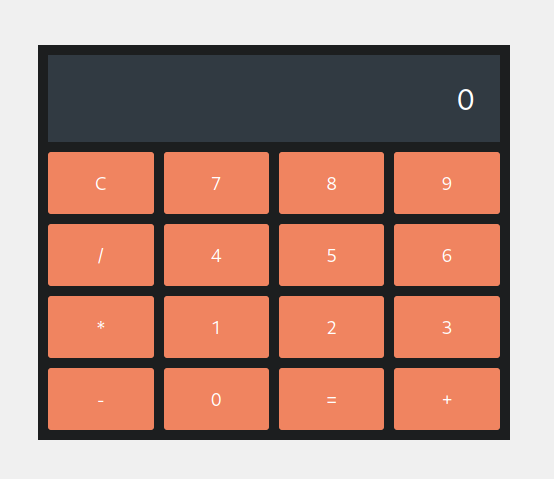

# Simple Calculator

This is a simple calculator built with HTML, CSS and JavaScript. The project allows you to perform basic mathematical operations, such as addition, subtraction, multiplication and division.

## Features

- Friendly and responsive interface.
- Basic operations: addition, subtraction, multiplication and division.
- Button to clear the result.
- Displays errors for invalid entries.

## Technologies Used

- **HTML**: For the page structure.
- **CSS**: For style and layout.
- **JavaScript**: For the calculator's operating logic.

## Demo



## How to Use

1. Clone this repository:
   ```bash
   git clone https://github.com/usuario/nome-do-repositorio.git
